# Remarket+

## 👥 Miembros del Equipo
| Nombre y Apellidos | Correo URJC | Usuario GitHub |
|:--- |:--- |:--- |
| Daniel Hernanz Corral | d.hernanz.2023@alumnos.urjc.es | DanielHernanz9 |
| Marcos Hernández Martín | m.hernandez.2023@alumnos.urjc.es | MarcosHM851 |
| Jorge Naranjo Ballesteros | j.naranjo.2023@alumnos.urjc.es | 2005JNB |

---

## 🎭 **Preparación 1: Definición del Proyecto**

### **Descripción del Tema**
ReMarket+ es una aplicación web de compra y venta online de productos nuevos, reacondicionados y de segunda mano. La plataforma permite a la empresa vender productos nuevos y reacondicionados, y a los usuarios publicar, comprar y vender productos de segunda mano.

### **Entidades**
Indicar las entidades principales que gestionará la aplicación y las relaciones entre ellas:

1. **Usuario**: Persona registrada que puede comprar, vender y valorar productos.
2. **Producto**: Artículo nuevo, reacondicionado o de segunda mano disponible en la plataforma.
3. **Pedido**: Compra realizada por un usuario que incluye uno o más productos.
4. **Valoracion**: Opinión de un usuario sobre un producto o vendedor tras una compra.

**Relaciones entre entidades:**
1. Usuario – Pedido: Un usuario puede realizar múltiples pedidos (0:N).
2. Pedido – Producto: Un pedido puede contener varios productos y un producto puede estar en varios pedidos (N:M).
3. Usuario – Producto: Un usuario puede publicar varios productos y cada producto pertenece a un único usuario (0:N).
4. Usuario – Valoración: Un usuario puede realizar varias valoraciones (0:N).
5. Producto – Valoración: Un producto puede tener varias valoraciones (0:N).

### **Permisos de los Usuarios**
Describir los permisos de cada tipo de usuario e indicar de qué entidades es dueño:

* **Usuario Anónimo**: 
  - Permisos: 
      1. Puede navegar por las categorias.
      2. Puede ver productos y valoraciones. 
      3. No puede comprar ni vender.
  - No es dueño de ninguna entidad

* **Usuario Registrado**: 
  - Permisos:
      1. Puede comprar productos.
      2. Puede publicar productos propios (solo productos de segunda mano)
      3. Puede gestionar su perfil, favoritos, mensajes y pedidos.
  - Es dueño de: 
      - Perfil de usuario.
      - Productos publicados.
      - Pedidos.
      - Valoraciones. 

* **Administrador**: 
  - Permisos:
      1. Puede gestionar usuarios, productos y pedidos.
      2. Puede aprobar, editar o eliminar productos.
      3. Puede gestionar valoraciones y categorias.
  - Es dueño de: 
      - Los productos nuevos y reacondicionados.
      - Las categorias.
      - La gestión global de pedidos y usuarios.

### **Imágenes**
Indicar qué entidades tendrán asociadas una o varias imágenes:

- **Usuario**: Imagen de avatar por usuario.
- **Producto**: Múltiples imagenes por producto.

### **Gráficos**
Indicar qué información se mostrará usando gráficos y de qué tipo serán:

- **Ventas mensuales**: Gráfico de barras.
- **Productos más vendidos**: Gráfico circular.
- **Usuarios registrados**: Gráfico de lineas.
- **Pedidos por tipo de producto**: Gráfico de barras.

### **Tecnología Complementaria**
Indicar qué tecnología complementaria se empleará:

- Envío de correos electrónicos automáticos para confirmaciones de pedidos y registros.
- Generación de facturas en PDF.

### **Algoritmo o Consulta Avanzada**
Indicar cuál será el algoritmo o consulta avanzada que se implementará:

- **Algoritmo/Consulta**: Detección de productos más comprados.
- **Descripción**: Cuenta las compras de cada tipo de producto y muestra más productos de ese tipo.
- **Alternativa**: Consulta que ordena productos por relevancia y precio.

---

## 🛠 **Preparación 2: Maquetación de páginas con HTML y CSS**

### **Vídeo de Demostración**
📹 **[Enlace al vídeo en YouTube](https://youtu.be/Lk7OcS_-km8?si=G5FnzZO8USZZBnr-)**
> Vídeo mostrando las principales funcionalidades de la aplicación web.

### **Diagrama de Navegación**
Diagrama que muestra cómo se navega entre las diferentes páginas de la aplicación:


> El flujo comienza en la página principal. El usuario puede iniciar sesión o registrarse, así como ver y buscar los productos publicados en la página (pero no ver su detalle). En caso de iniciar sesión con una cuenta de administrador, la aplicación le llevará a la web de control de administrador. En caso contrario, el usuario volverá a la página principal, pero como usuario registrado. Ahora, el usuario tiene permitido ver el detalle de los productos, ver su perfil, publicar productos de segunda mano, y ver sus pedidos, su resumen de productos publicados y su carrito de la compra. Por su parte, el administrador puede ver estadísticas globales de la aplicación, aprovar pedidos y productos, y bloquear y desbloquear usuarios.

### **Capturas de Pantalla y Descripción de Páginas**

> Se describen a continuación las diferentes pantallas de las que se compone nuestra aplicación web. En el caso de que una pantalla pueda ser accedida tanto para usuarios registrados como para usuarios no registrados, se asume que el navbar cambia para mostrar las opciones acordes al tipo de usuario que hace uso de la página.

#### **1. Página Principal / Home**
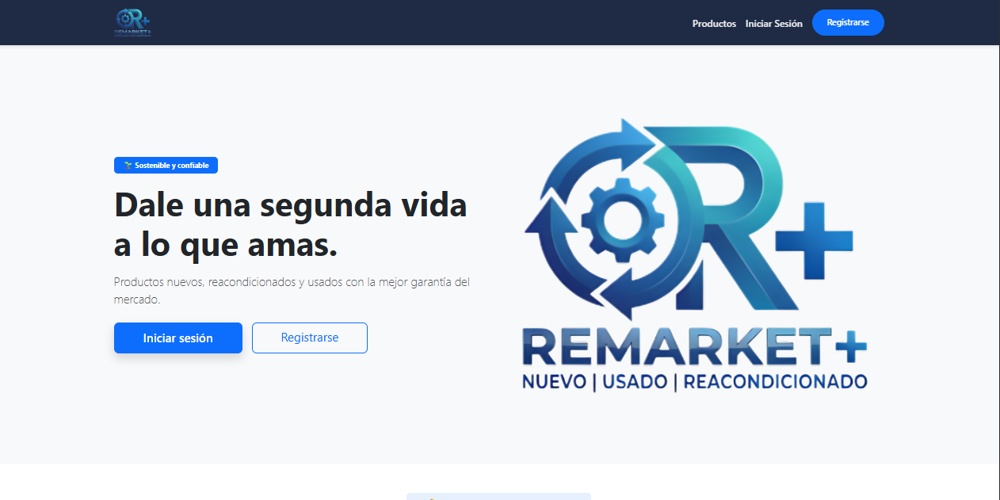

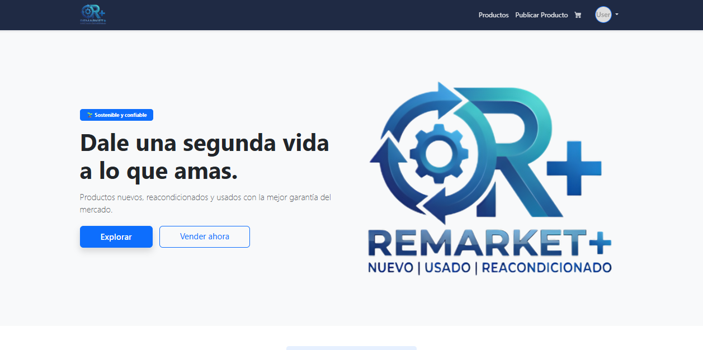

> Página de inicio de la aplicación. Incluye una cabecera con el logotipo y eslogan de la marca y una lista de productos destacados.

#### **2. Inicio de Sesión / Log In**
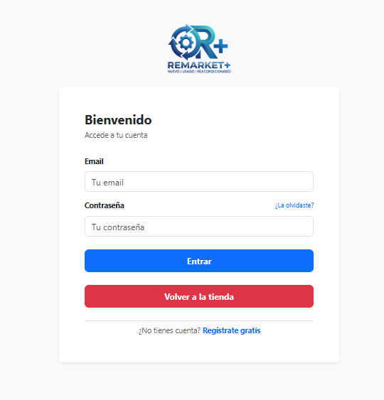

> Formulario que permite a los usuarios registrados introducir su usuario y contraseña para inciar sesión y poder utilizar los servicios principales de la tienda.

#### **3. Registro de Usuario / Sign Up**
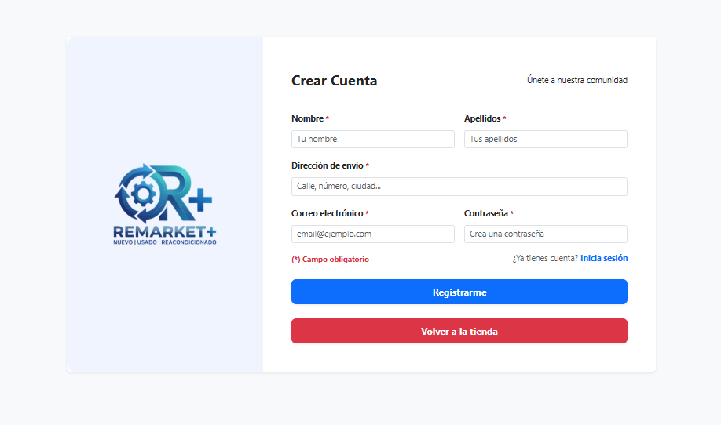

> Formulario que permite a los usuarios no registrados registrarse para poder utilizar los servicios de la tienda como usuario identificado.

#### **4. Visualización de todos los productos / Búsqueda de productos**
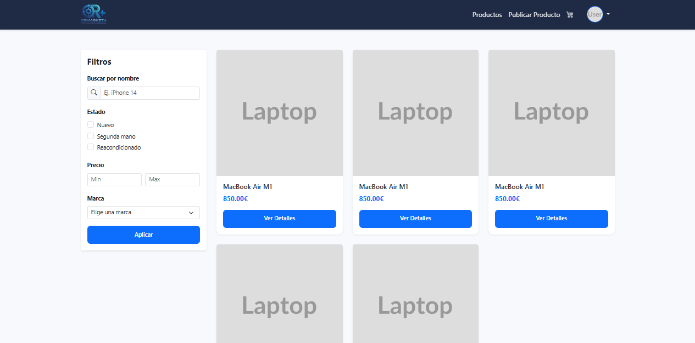

> Página que muestra todos los productos disponibles en la tienda actualmente. Incluye un formulario a la izquierda que permite buscar y filtar productos, para que el usuario pueda encontrar el producto que necesite comprar.

#### **5. Detalle de producto**
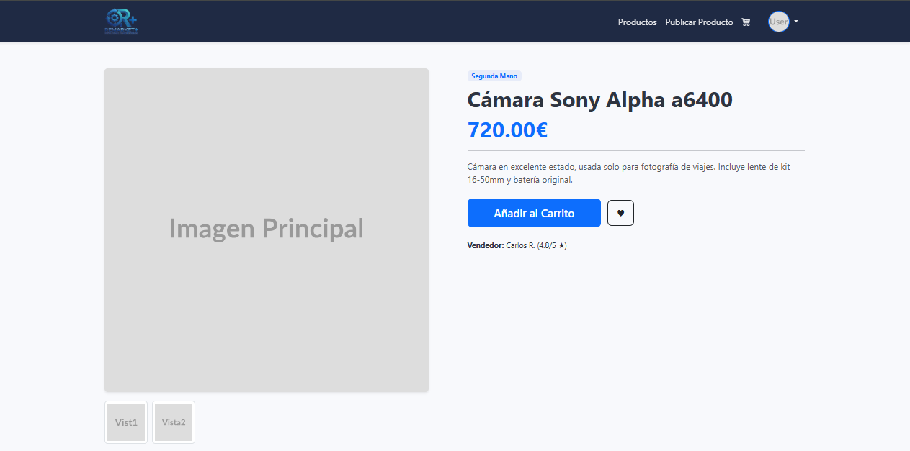

> Página que muestra las principales características de un producto, así como sus imágenes. En caso de estar registrado el usuario, podrá añadirlo al carrito desde esta página. Además, si el producto es nuevo o reacondicionado, aparecerán reseñas del mismo. Como los productos de segunda mano no se producen ni distribuyen en masa, no tendrán reseñas al tener un único comprador.

#### **6. Publicación de nuevo producto**
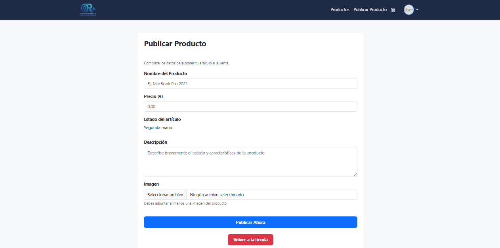

> Formulario que recoge los datos de los productos de segunda mano que los usuarios registrados quieren publicar para su venta. Observar que el estado indica directamente segunda mano: esto es así debido a que los usuarios registrados no pueden poner a la venta productos nuevos o reacondicionados, sólo pueden vender objetos de segunda mano. Los productos publicados por los usuarios registrados deben ser aprobados por un administrador.

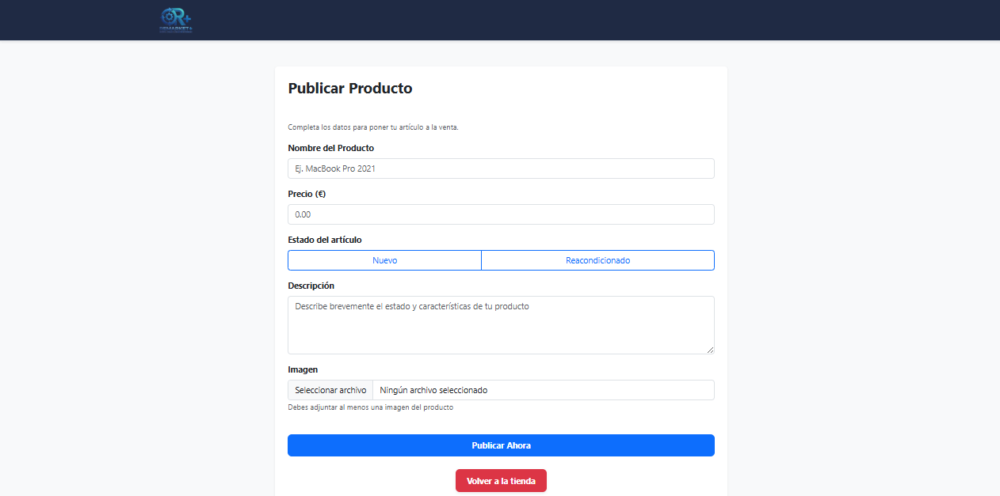

> Existe un formulario diferente para administradores, los cuales pueden publicar artículos nuevos y reacondicionados.

#### **7. Carrito de la compra**
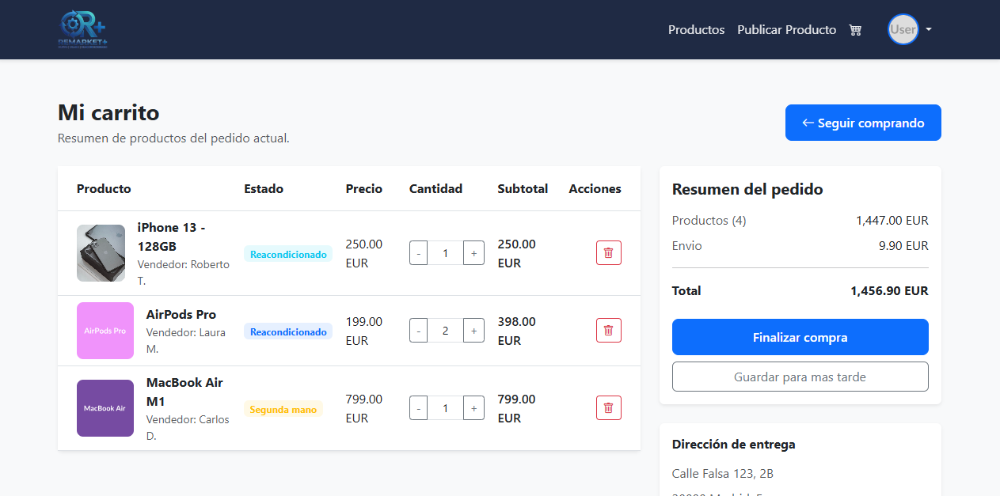

> Página que muestra los productos que el usuario registrado acumula para su posterior compra en conjunto.

#### **8. Perfil de usuario registrado**
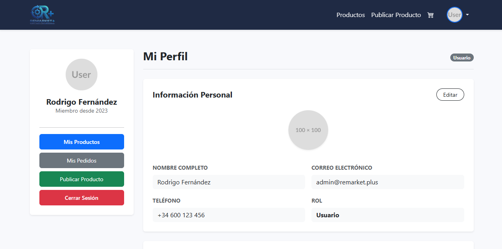

> Página que muestra todos los datos del usuario registrado que está haciendo uso de la aplicación. Desde esta pantalla los usuarios registrados pueden acceder a todos los servicios que la aplicación ofrece para este tipo de usuario.

#### **9. Productos publicados de usuario registrado / Mis productos**
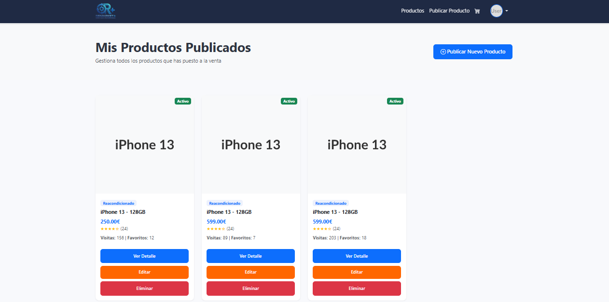

> Página que muestra todos los productos que el usuario registrado ha puesto a la venta. Desde esta pantalla el usuario puede publicar, ver detalle, editar, y eliminar los productos que ha puesto a la venta.

#### **10. Resumen de pedidos de usuario registrado / Mis pedidos**
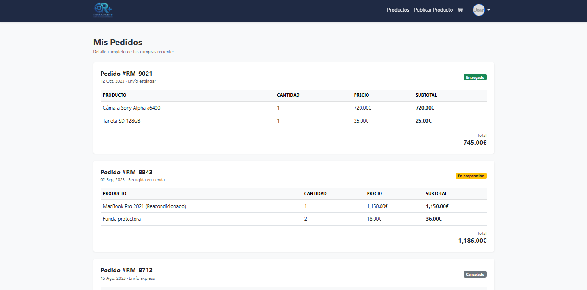

> Página que muestra un resumen de todos los pedidos que el usuario registrado ha realizado.

#### **11. Panel de administrador**
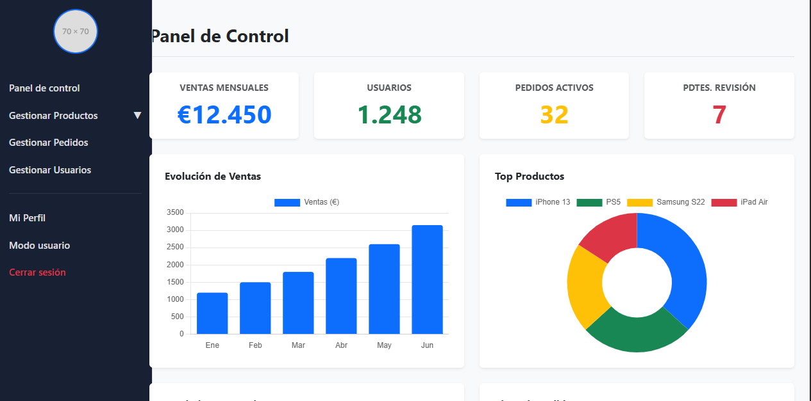

> Página que muestra diversas métricas útiles para la administración del negocio.

#### **12. Productos publicados / Admin**
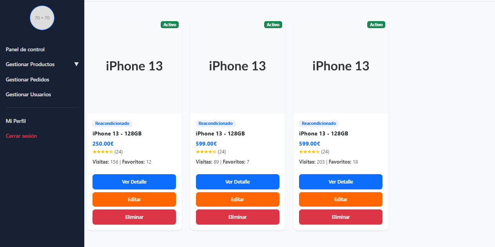

> Página exclusiva de administradores en la que se pueden visualizar todos los productos publicados actualemente en la web.

#### **13. Aprobación de productos**
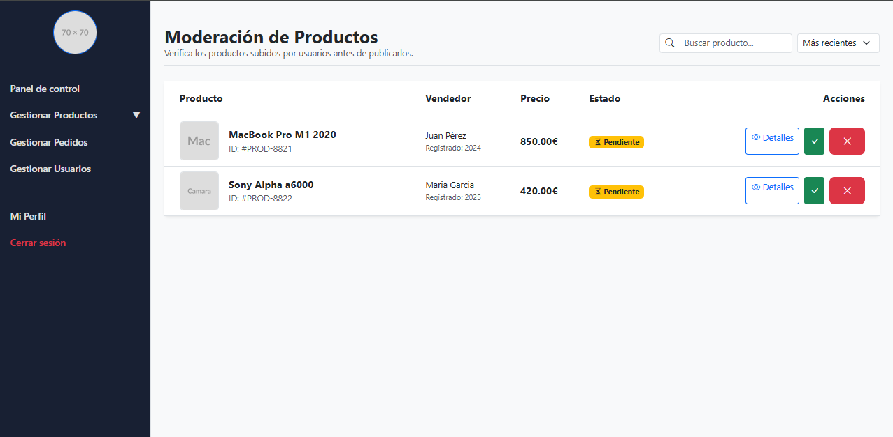

> Página en que permite a los administradores aprobar (o denegar) las solicitudes de aprobación de los productos que los usuarios registrados publican.  

#### **14. Gestión de pedidos**
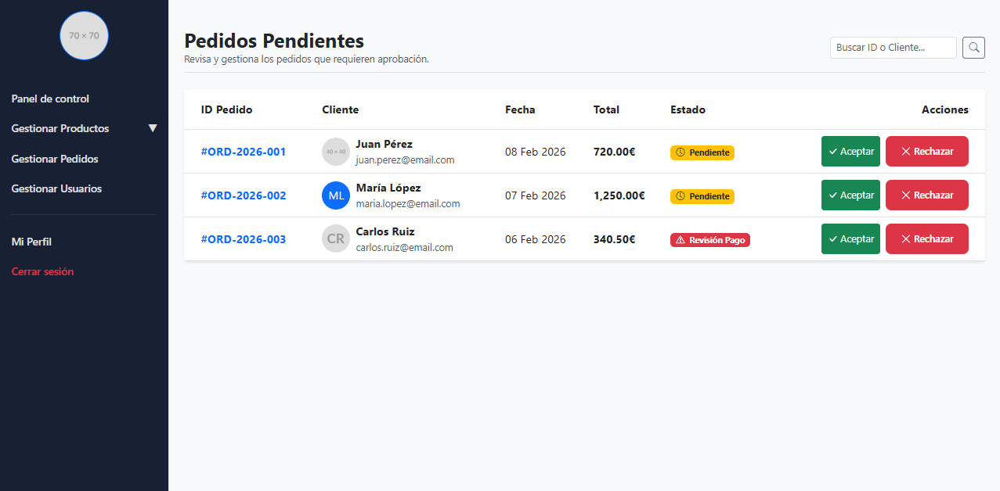

> Página que permite a los administrados aprobar (o denegar) los pedidos que hacen los usuarios registrados. 

#### **15. Gestión de usuarios**


> Página que permite a los administradores controlar los usuarios que tienen acceso a la aplicación web, pudiendo bloquearles en caso de incumplir las normas de publicación de ReMarket+.

#### **16. Perfil de administrador**
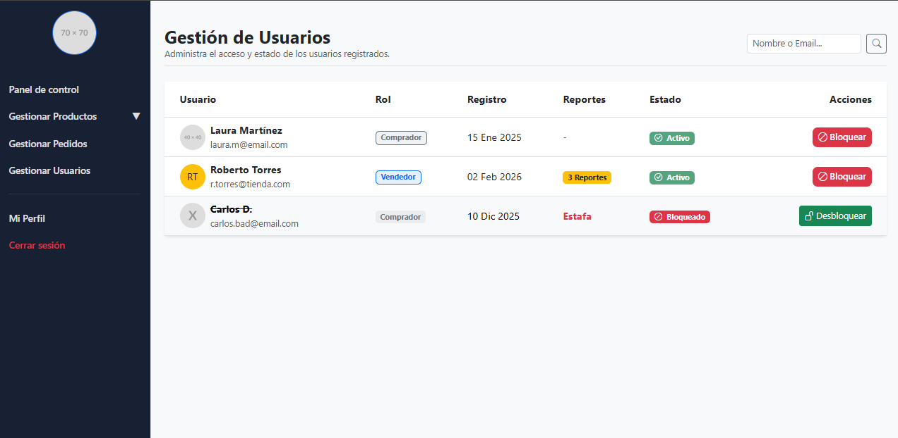

> Página que muestra los datos del administrador que se encuentra utilizando la aplicación.

---

## 🛠 **Práctica 1: Web con HTML generado en servidor y AJAX**

### **Vídeo de Demostración**
📹 **[Enlace al vídeo en YouTube]([https://www.youtube.com/watch?v=x91MPoITQ3I](https://youtu.be/sM6xG_zOkyA?si=FarT2MzmAVvu6vqY)]())**
https://www.youtube.com/watch?v=sM6xG_zOkyA

> Vídeo mostrando las principales funcionalidades de la aplicación web.

### **Navegación y Capturas de Pantalla**

#### **Diagrama de Navegación**

Solo si ha cambiado.

#### **Capturas de Pantalla Actualizadas**

Solo si han cambiado.

### **Instrucciones de Ejecución**

#### **Requisitos Previos**
- **Java**: versión 21 o superior
- **Maven**: versión 3.8 o superior
- **MySQL**: versión 8.0 o superior
- **Git**: para clonar el repositorio

#### **Pasos para ejecutar la aplicación**

1. **Clonar el repositorio**
   ```bash
   git clone https://github.com/CodeURJC-DAW-2025-26/practica-daw-2025-26-grupo-3.git
   cd practica-daw-2025-26-grupo-3
   ```

2. **Ejecutar la aplicación**
Localiza el archivo principal del proyecto en tu IDE (IntelliJ, VS Code, etc.):

src/main/java/es/grupo3/practica25_26/Practica2526Application.java

3. **Acceso a la web**
Una vez que la aplicación esté iniciada, abre tu navegador y accede a:

https://localhost:8443


#### **Credenciales de prueba**
- **Usuario Admin**: usuario: `admin@admin.com`, contraseña: `admin1234`
- **Usuario Registrado**: usuario: `marta@example.com`, contraseña: `demo1234`
- **Usuario Registrado**: usuario: `carlos@example.com`, contraseña: `demo1234`

### **Diagrama de Entidades de Base de Datos**

Diagrama mostrando las entidades, sus campos y relaciones:

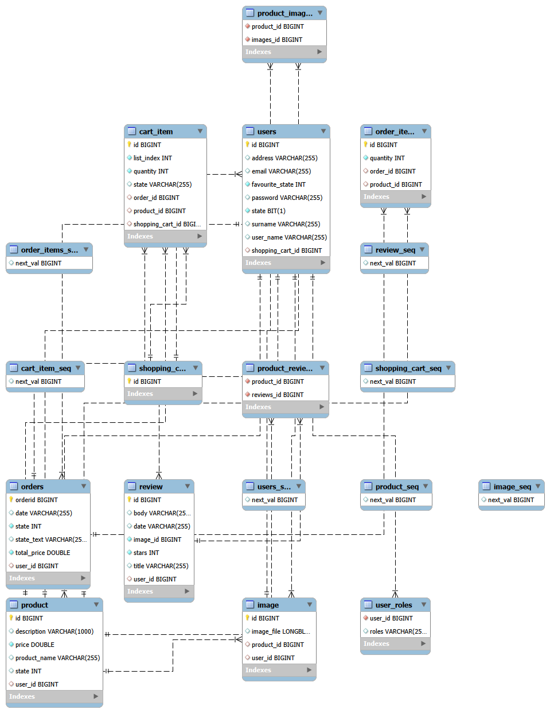

El diagrama muestra las entidades principales que estructuran la plataforma: Users (usuarios), Product (productos), Orders (pedidos) y Review (reseñas). Se observan claramente las relaciones entre ellas, como la relación 1:N donde un usuario puede ser vendedor de múltiples productos, o cómo un producto agrupa múltiples imágenes y comentarios (visibles a través de las tablas relacionales product_images y product_reviews).
Además, el modelo incluye la lógica completa del proceso de compra mediante las entidades Shopping_Cart (carrito de la compra), Cart_Item (elementos del carrito) y las tablas asociadas a los ítems del pedido. Finalmente, se aprecian las tablas auxiliares terminadas en _seq (como product_seq o review_seq), que corresponden a las secuencias generadas automáticamente por JPA/Hibernate para autoincrementar las claves primarias (IDs), y la tabla user_roles encargada de gestionar los permisos de seguridad (USER/ADMIN).

### **Diagrama de Clases y Templates**

Diagrama de clases de la aplicación con diferenciación por colores o secciones:

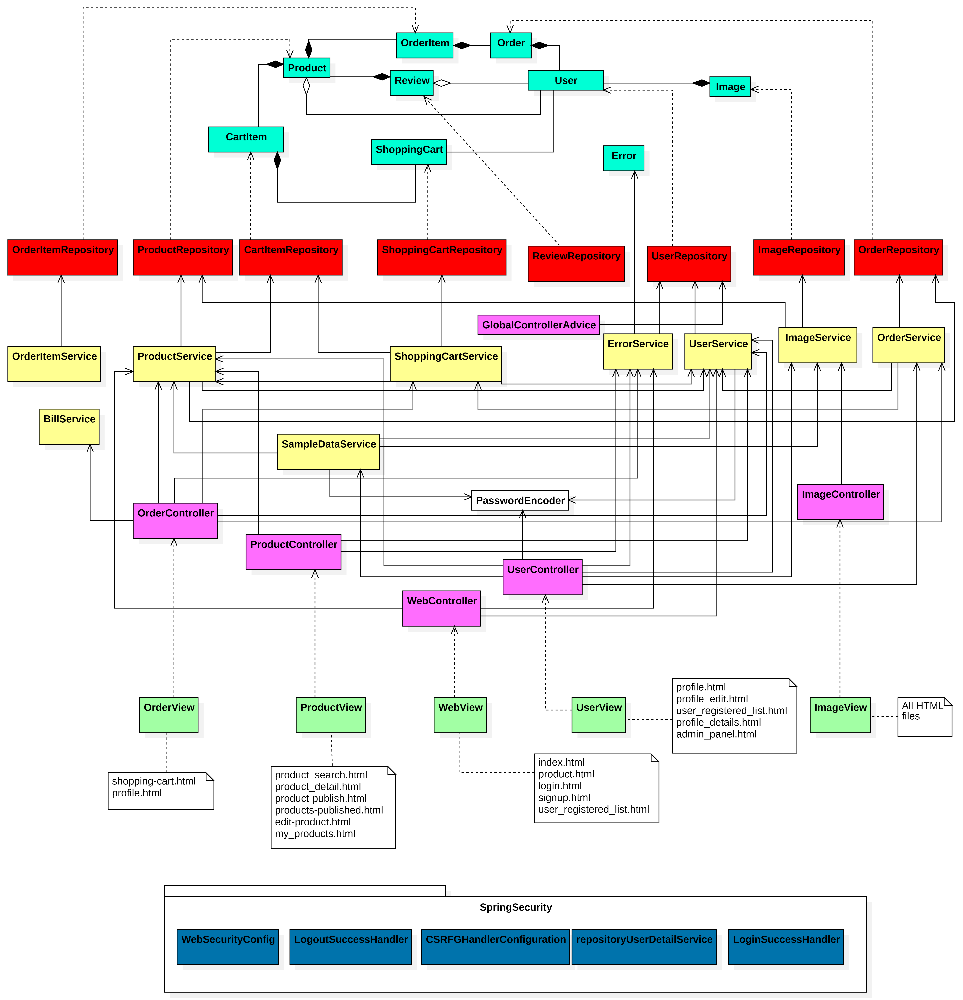

> Turquesa: Modelo
> Rojo: Repositorio
> Amarillo: Servicios
> Rosa: Controladores
> Verde: Vistas
> Azul: Seguridad

### **Participación de Miembros en la Práctica 1**

#### **Alumno 1 - Daniel Hernanz Corral**

Encargado de realizar todas las funcionalidades relacionadas con la creación, edición y visualización de los productos y reviews con sus respectivas comprobaciones en el frontend y backend. También he añadido diversos productos de ejemplo a la base de datos, he añadido tambien la funcionalidad de mostrar más productos del index con ajax. Ademas he arreglado diversos errores que han ocurrido durante el desarrollo de la web.
Tambien he agregado diferentes funcionalidades para el manejo de imagenes, como por ejemplo el carrousel de imagenes del html del detalle del producto entre otras cosas.

| Nº | Commits | Files |
| :---: | :---: | :---: |
| 1 | [Implemented all validations when a product is added or edited, deleted unnecessary html and also added a change in css to see description of products correctly](https://github.com/CodeURJC-DAW-2025-26/practica-daw-2025-26-grupo-3/commit/b7cc6099a02ead745115edf924ff9cc6058849b0) | [ProductController.java](backend/src/main/java/es/grupo3/practica25_26/controller/ProductController.java) |
| 2 | [Added images class,controller,service and Repository. Now products can have images (its not completed at 100%)](https://github.com/CodeURJC-DAW-2025-26/practica-daw-2025-26-grupo-3/commit/edba18f6217b3e6efd41bec80ed2fb76f3d33739) | [Image.java](backend/src/main/java/es/grupo3/practica25_26/model/Image.java) |
| 3 | [Implement product editing functionality: Added edit product form and save logic in ProductController (but not completed at 100%), created edit_product.html template, and updated product detail views for user-specific editing.](https://github.com/CodeURJC-DAW-2025-26/practica-daw-2025-26-grupo-3/commit/871b895f5680aa8ed22b00de18005ec599e1952f) | [ProductController.java](backend/src/main/java/es/grupo3/practica25_26/controller/ProductController) |
| 4 | [Added new class Product controller and more changes in new product form](https://github.com/CodeURJC-DAW-2025-26/practica-daw-2025-26-grupo-3/commit/0560c379d632aafb5ec0b0c876aa571115609636) | [ProductController.java](backend/src/main/java/es/grupo3/practica25_26/controller/ProductController.java) |
| 5 | [Fully functional product details; I've also added a boostrap carousel to navigate through the different images.](https://github.com/CodeURJC-DAW-2025-26/practica-daw-2025-26-grupo-3/commit/7372aa2a99468bee512bb6cf4f05284df8b6b77f) | [product_detail.html](backend/src/main/resources/templates/product_detail.html) |

---

#### **Alumno 2 - Marcos Hernández Martín**

Implemented all user autentication logic. Also implemented orders & shopping cart, reviews, PDF export and advanced query.
| Nº    | Commits      | Files      |
|:------------: |:------------:| :------------:|
|1| [Refactor user registration and profile handling; add CSRF protection to signup form and update image handling in navbar](https://github.com/CodeURJC-DAW-2025-26/practica-daw-2025-26-grupo-3/commit/c4c663f53cf67b2228d1c6264796871d773fdc07)  | [UserController.java](backend/src/main/java/es/grupo3/practica25_26/controller/UserController.java)   |
|2| [Implement shopping cart functionality: Updated OrderController to handle user-specific cart actions, added CartItemRepository, and enhanced ShoppingCartService for item management. Modified shopping-cart.html for dynamic display of cart items](https://github.com/CodeURJC-DAW-2025-26/practica-daw-2025-26-grupo-3/commit/f07f2a161147b94a71cbb8ab2fdc5955b9f71e58)  | [OrderController.java](backend/src/main/java/es/grupo3/practica25_26/controller/OrderController.java)   |
|3| [Orders in profile implemented & fiexed index login, logout and register banners style.](https://github.com/CodeURJC-DAW-2025-26/practica-daw-2025-26-grupo-3/commit/402f70a1f041c3982b8e71211e226306ed59b528)  | [OrderController.java](backend/src/main/java/es/grupo3/practica25_26/controller/OrderController.java)   |
|4| [Product review implementation](https://github.com/CodeURJC-DAW-2025-26/practica-daw-2025-26-grupo-3/commit/7ddd59cd93ce4819c8663f0af789247ed0b169a1)  | [ProductController.java](backend/src/main/java/es/grupo3/practica25_26/controller/ProductController.java)   |
|5| [PDF bills export](https://github.com/CodeURJC-DAW-2025-26/practica-daw-2025-26-grupo-3/commit/155aa519dc782c137e0ad0a9b341b77add7559aa)  | [OrderController.java](backend/src/main/java/es/grupo3/practica25_26/controller/OrderController.java)   |

---

#### **Alumno 3 - Jorge Naranjo Ballesteros**

[Descripción de las tareas y responsabilidades principales del alumno en el proyecto]

| Nº | Commits | Files |
| :---: | :---: | :---: |
| 1 | [Add user details page and update user list with links; refactor User model and security config](https://github.com/CodeURJC-DAW-2025-26/practica-daw-2025-26-grupo-3/commit/85842d86d52766bbb4152cbb1bf1762d4fc65951) | [profile_details](https://github.com/CodeURJC-DAW-2025-26/practica-daw-2025-26-grupo-3/commit/85842d86d52766bbb4152cbb1bf1762d4fc65951#diff-1930f09b3abf52622c4a98dfc1d3e6e76ea1cd6c25dbd9ed06a117e8cb62184a) |
| 2 | [Refactor Order and Web Controllers: Implemented dependency injection, updated Order model to include user association, and enhanced OrderRepository with a custom query for pending and revised orders. Improved orders_list.html for better data presentation and user experience.](https://github.com/CodeURJC-DAW-2025-26/practica-daw-2025-26-grupo-3/commit/5d5935e2621a0f4d77738b8e7e1b232d2bb684cf) | [OrderController](https://github.com/CodeURJC-DAW-2025-26/practica-daw-2025-26-grupo-3/commit/5d5935e2621a0f4d77738b8e7e1b232d2bb684cf#diff-aac3ea106f28a818662a2c745941c28e22a16adc32cc7d4f0a9962f534bfc622) |
| 3 | [Implement top-selling products feature and product state distribution in admin panel](https://github.com/CodeURJC-DAW-2025-26/practica-daw-2025-26-grupo-3/commit/21b5bbc022017a04136392fe5ad477caf10a60da) | [WebController](https://github.com/CodeURJC-DAW-2025-26/practica-daw-2025-26-grupo-3/commit/21b5bbc022017a04136392fe5ad477caf10a60da#diff-3c9865c6692d087a18cbc0653ce38fd84bfe5d96d8214bc26d10aac9724d82aa) |
| 4 | [Refactor admin panel templates: Extracted sidebar into a separate file for reusability, updated all relevant templates to use the new sidebar component, and improved logging configuration in application properties. Removed products_pending_list.html as it is no longer needed.](https://github.com/CodeURJC-DAW-2025-26/practica-daw-2025-26-grupo-3/commit/69ba823a0d9a76b6cb1162c5c877ba7b3056b7bd) | [products_pending_list](https://github.com/CodeURJC-DAW-2025-26/practica-daw-2025-26-grupo-3/commit/69ba823a0d9a76b6cb1162c5c877ba7b3056b7bd#diff-8f3a10b1a5ba8c48699552a08c690be1120cd8b621297c35f2b16966ac80e380) |
| 5 | [users state](https://github.com/CodeURJC-DAW-2025-26/practica-daw-2025-26-grupo-3/commit/14c23b4ce0cd8a9ee304dfdf9760befefa70fbb0) | [WebController](https://github.com/CodeURJC-DAW-2025-26/practica-daw-2025-26-grupo-3/commit/14c23b4ce0cd8a9ee304dfdf9760befefa70fbb0#diff-3c9865c6692d087a18cbc0653ce38fd84bfe5d96d8214bc26d10aac9724d82aa) |
---

## 🛠 **Práctica 2: Incorporación de una API REST a la aplicación web, despliegue con Docker y despliegue remoto**

### **Vídeo de Demostración**
📹 **[Enlace al vídeo en YouTube](https://youtu.be/Pz15AhF0JZM)**
> Vídeo mostrando las principales funcionalidades de la aplicación web.

### **Documentación de la API REST**

#### **Especificación OpenAPI**
📄 **[Especificación OpenAPI (YAML)](/api-docs/api-docs.yaml)**

#### **Documentación HTML**
📖 **[Documentación API REST (HTML)](https://rawcdn.githack.com/CodeURJC-DAW-2025-26/practica-daw-2025-26-grupo-3/46a93e139f95f4957a33a020976c8b25ac984bd8/api-docs/api-docs.html)**

> La documentación de la API REST se encuentra en la carpeta `/api-docs` del repositorio. Se ha generado automáticamente con SpringDoc a partir de las anotaciones en el código Java.

### **Diagrama de Clases y Templates Actualizado**

Diagrama actualizado incluyendo los @RestController y su relación con los @Service compartidos:

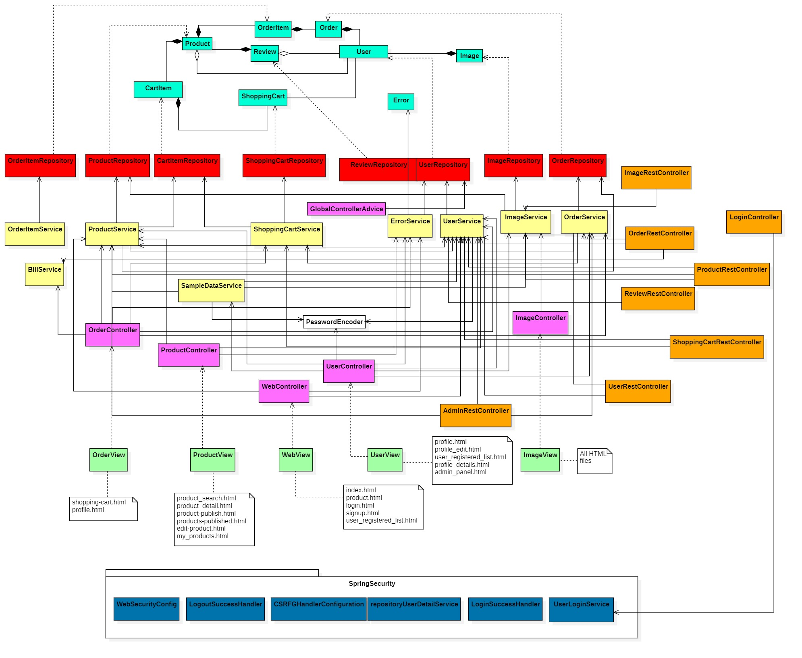

### **Instrucciones de Ejecución con Docker**

#### **Requisitos previos:**
- Docker instalado (versión 20.10 o superior)
- Docker Compose instalado (versión 2.0 o superior)

#### **Pasos para ejecutar con docker-compose:**

1. **Clonar el repositorio** (si no lo has hecho ya):
   ```bash
   git clone https://github.com/CodeURJC-DAW-2025-26/practica-daw-2025-26-grupo-3.git
   cd practica-daw-2025-26-grupo-3
   ```

2. **Entrar en la carpeta docker**:

   ```bash
   cd docker
   ```

3. **Arrancar en Modo Inicialización (Primera ejecución) o en Modo Ejecución (Arranques posteriores)**

#### 3.1 **Modo Inicialización**

Si la aplicación no se ha levantado anteriormente, la base de datos está completamente vacía. Es necesario crear la estructura de las tablas (esquema) y cargar los datos de ejemplo (usuarios, productos, imágenes y pedidos).
Para arrancar en este modo, le pasamos la variable de entorno `DDL_AUTO=update` para que Hibernate genere las tablas. Una vez generadas, el servicio interno detectará que la BD está vacía y la llenará automáticamente:

   ```bash
   DDL_AUTO=update docker compose up -d
   ```

#### 3.2 **Modo Ejecución**

Una vez que la base de datos ya haya sido inicializada, los datos persisten en un volumen de Docker. Si se detienen los contenedores y los vuelves a arrancar, se debe usar el modo de ejecución.
Por defecto, la variable `DDL_AUTO` toma el valor `none`, por lo que no modificará las tablas. Además, el servicio de inicialización detectará que ya existen usuarios y omitirá la carga de datos para evitar duplicados:

   ```bash
   DDL_AUTO=none docker compose up -d
   ```

4. **Acceder a la aplicación**
Una vez que los contenedores estén levantados y la aplicación haya arrancado, abre tu navegador web y accede a:

   https://localhost:8443


5. **Detener la aplicación**

   ```bash
   docker compose down
   ```


### **Construcción de la Imagen Docker**

#### **Requisitos:**
- Docker instalado en el sistema

#### **Pasos para construir y publicar la imagen:**

1. **Navegar al directorio de Docker**:
   ```bash
   cd docker
   ```

2. **Iniciamos sesión con docker**
   ```bash
   docker login
   ```

3. **Creamos la imagen de la aplicación**
    ```bash
   ./create_image.sh (nombre del usuario de docker)/(nombre de la imagen) 
   ```

4. **Publicamos la imagen en dockerhub**
   ```bash
   ./publish_image.sh (nombre del usuario de docker)/(nombre de la imagen) 
   ```
5. **Publicamos el archivo docker-compose.yml como un artefacto OCI**
   ```bash
   ./publish_docker-compose.sh (nombre del usuario de docker)/(nombre del repositorio compose):(tag de la versión) 
   ```


### **Despliegue en Máquina Virtual**

#### **Requisitos:**
- Acceso a la máquina virtual (SSH)
- Clave privada para autenticación
- Conexión a la red correspondiente o VPN configurada

#### **Pasos para desplegar:**

1. **Preparamos el acceso desde nuestro PC**: 
   Damos los permisos correctos al archivo de la clave
   ```bash
   chmod 600 ssh-keys/appWeb03.key
   ```
2. **Conectamos a la Máquina Virtual**:
   ```bash
   ssh -i ssh-keys/appWeb03.key vmuser@10.100.139.97
   ```
3. **Despleagamos con Docker Compose por primera vez**:
   Usamos este comando la primera vez con DDL_AUTO=update para que se creen las tablas en la base de datos (modo inicialización)
   ```bash
      sudo DB_PASSWORD=Grupo3DAW DB_NAME=practicadaw DDL_AUTO=update \
      docker compose -f oci://docker.io/marcoshm851/practica2daw-compose:latest up -d
   ```
4. **Paramos la aplicación sin borrar los datos**:
   ```bash
   sudo docker compose -f oci://docker.io/marcoshm851/practica2daw-compose:latest down
   ```
5. **Reiniciamos e iniciamos en modo ejecución**:
   Usamos este comando con DDL_AUTO=none para que ya no se creen las tablas en la base de datos (modo ejecución)
   ```bash
      sudo DB_PASSWORD=Grupo3DAW DB_NAME=practicadaw \
      docker compose -f oci://docker.io/marcoshm851/practica2daw-compose:latest up -d
   ```

### **URL de la Aplicación Desplegada**

🌐 **URL de acceso**: `https://appweb03.dawgis.etsii.urjc.es:8443/`

#### **Credenciales de Usuarios de Ejemplo**

| Rol | Usuario | Correo | Contraseña |
|:---|:---|:---|:---|
| Administrador | admin | admin@admin.com | admin1234 |
| Usuario Registrado | marta | marta@example.com | demo1234 |
| Usuario Registrado | carlos | carlos@example.com | demo1234 |

### **Participación de Miembros en la Práctica 2**

#### **Alumno 1 - Jorge Naranjo Ballesteros**

El alumno ha completado la implementación del sistema de carrito de compra y gestión de pedidos, utilizando patrones DTO y Mappers para asegurar una transferencia de datos limpia entre capas. Se han desarrollado los controladores REST necesarios para gestionar el ciclo de vida del carrito (añadir, listar y eliminar productos) y la conversión de estos en pedidos finales. Además, se ha integrado un módulo de estadísticas con acceso restringido para administradores, se ha generado la documentación completa de la API y se ha automatizado el despliegue mediante la subida de la imagen y el archivo docker-compose.yml (como OCI Artifact) a DockerHub.

| Nº    | Commits      | Files      |
|:------------: |:------------:| :------------:|
|1| [Implement shopping cart functionality with REST API endpoints for managing cart items](https://github.com/CodeURJC-DAW-2025-26/practica-daw-2025-26-grupo-3/commit/8deac0479f7d2d99195c851cf628fe3f793d9f6d)  | [ShoppingCartRestController.java](backend/src/main/java/es/grupo3/practica25_26/controller/restcontroller/ShoppingCartRestController.java)   |
|2| [Add admin statistics endpoints and update Postman collection](https://github.com/CodeURJC-DAW-2025-26/practica-daw-2025-26-grupo-3/commit/8cfd662fc49a93c6225936138acb2acb489df179)  | [AdminRestController.java](backend/src/main/java/es/grupo3/practica25_26/controller/AdminRestController.java)   |
|3| [Implement order processing functionality with DTOs and mappers for shopping cart conversion](https://github.com/CodeURJC-DAW-2025-26/practica-daw-2025-26-grupo-3/commit/84adeb2dc7cd41b570f84c603d75ef4c5efeeed3)  | [OrderRestController.java](backend/src/main/java/es/grupo3/practica25_26/controller/restcontroller/OrderRestController.java)   |
|4| [Add admin statistics endpoints and update Postman collection](https://github.com/CodeURJC-DAW-2025-26/practica-daw-2025-26-grupo-3/commit/8cfd662fc49a93c6225936138acb2acb489df179)  | [AdminRestController.java](backend/src/main/java/es/grupo3/practica25_26/controller/AdminRestController.java)   |
|5| [Update Postman collection: modify IDs and add ShoppingCartToOrder request](https://github.com/CodeURJC-DAW-2025-26/practica-daw-2025-26-grupo-3/commit/f8a3dc7cf1baca71d785aae4bec1cb2e94a61985)  | [Postman_collection.json](Practica2DAW.postman_collection.json)   |

---

#### **Alumno 2 - Daniel Hernanz Corral**

El alumno se ha encargado de montar toda la parte de los DTOs de productos, incluyendo sus Mappers y REST Controllers (dejando listos los endpoints GET, POST, PUT y DELETE). También echó un cable con el DTO de las reviews. Además, implementó la lógica para poder gestionar de forma completa (CRUD) las imágenes de los perfiles de usuario y de los productos. Por otro lado, metió la paginación en la web para que el catálogo cargue de 8 en 8 por defecto. Ayudó a la configuración de la documentación de OpenApi aparte de añadir la configuración relativa a docker. Además también ayudó al arreglo de diversos errores ocurridos durante la práctica que por ejemplo impedían la visualización de esta última.

| Nº | Commits | Files |
| :---: | :---: | :---: |
| 1 | [Add DTOs and mappers for Product and Review entities; implement Product REST controller](https://github.com/CodeURJC-DAW-2025-26/practica-daw-2025-26-grupo-3/commit/571823eb0e52f26fbd7cfc75d608114862c4231a) | [ProductRestController.java](backend/src/main/java/es/grupo3/practica25_26/restcontroller/ProductRestController.java) |
| 2 | [Now products are editable with the api rest (except images at this moment). Updateproduct method in ProductService has been updated, and also the addImageToProduct and removeImageFromProduct methods have been added to product Service. Fixed an important error that prevented users from seeing the page (None of the pages could be viewed; it gave an error)](https://github.com/CodeURJC-DAW-2025-26/practica-daw-2025-26-grupo-3/commit/40116e5d10074bfb4e078c82fc554e7d4f213c18) | [ProductService.java](backend/src/main/java/es/grupo3/practica25_26/service/ProductService.java) |
| 3 | [Added get,delete,update methods to the images of the products and refactors in some service to make it clearer and meaningful.](https://github.com/CodeURJC-DAW-2025-26/practica-daw-2025-26-grupo-3/commit/13891460746d784fcdc3616cddb043449ddd0d66) | [ImageRestController.java](backend/src/main/java/es/grupo3/practica25_26/controller/restcontroller/ImageRestController.java) |
| 4 | [Added get,delete,put and post to the image of users, fixed some errors that occurred when initalizing the data base and updated the postman collection and more](https://github.com/CodeURJC-DAW-2025-26/practica-daw-2025-26-grupo-3/commit/f5ac364017bb5b608c67e6456d2834a6066a38bc) | [UserRestController.java](backend/src/main/java/es/grupo3/practica25_26/controller/restcontroller/UserRestController.java) |
| 5 | [Added pageable functionality to display products (pages can hold 8 products). Additionally, I've added checks for API requests to create and update products.](https://github.com/CodeURJC-DAW-2025-26/practica-daw-2025-26-grupo-3/commit/39f099b37e920efc53f043d06992ce1b224eb296) | [ProductRestController.java](backend/src/main/java/es/grupo3/practica25_26/controller/restcontroller/ProductRestController.java) |

---

#### **Alumno 3 - Marcos Hernandez Martín**

[Descripción de las tareas y responsabilidades principales del alumno en el proyecto]

| Nº    | Commits      | Files      |
|:------------: |:------------:| :------------:|
|1| [Add API REST security](https://github.com/CodeURJC-DAW-2025-26/practica-daw-2025-26-grupo-3/commit/50deccf6adf35106a5f6ae01651a8242a8b5ed3e)  | [Archivo1](https://github.com/CodeURJC-DAW-2025-26/practica-daw-2025-26-grupo-3/commit/50deccf6adf35106a5f6ae01651a8242a8b5ed3e#diff-34049c3bc6deee4bbf269544338e0450399140da63fec684096d1ae0ce70b4bb)   |
|2| [Add ReviewDTO, ReviewMapper, and ReviewRestController for review API REST management](https://github.com/CodeURJC-DAW-2025-26/practica-daw-2025-26-grupo-3/commit/f3047608ab9bb2b5217fcab97398d1dc7d950df1)  | [Archivo2](https://github.com/CodeURJC-DAW-2025-26/practica-daw-2025-26-grupo-3/commit/f3047608ab9bb2b5217fcab97398d1dc7d950df1#diff-28654c678cb3e968027d5147d71c8dbc4588f099065311fb008f092bcda9d1e7)   |
|3| [Added API REST support for creating and updating users](https://github.com/CodeURJC-DAW-2025-26/practica-daw-2025-26-grupo-3/commit/412b245e7c05c1ced7417cf8314b9de4d6d5f5a3)  | [Archivo3](https://github.com/CodeURJC-DAW-2025-26/practica-daw-2025-26-grupo-3/commit/412b245e7c05c1ced7417cf8314b9de4d6d5f5a3#diff-c3dacf4557393f5984ba05f9080e1fb47ce39f5577dcec228b9a1381e7934fa1)   |
|4| [Implemented API REST support for get & delete users](https://github.com/CodeURJC-DAW-2025-26/practica-daw-2025-26-grupo-3/commit/03f042b199bdf2d0101fa610fea65c4936c383b3)  | [Archivo4](https://github.com/CodeURJC-DAW-2025-26/practica-daw-2025-26-grupo-3/commit/03f042b199bdf2d0101fa610fea65c4936c383b3#diff-34049c3bc6deee4bbf269544338e0450399140da63fec684096d1ae0ce70b4bb)   |
|5| [Improved shopping cart functionality: added ShoppingCartController, implemented quantity modification via api rest, and updated user registration to initialize shopping cart.](https://github.com/CodeURJC-DAW-2025-26/practica-daw-2025-26-grupo-3/commit/145e2e3b88a521c78c0f12339771b15368f7c081)  | [Archivo5](https://github.com/CodeURJC-DAW-2025-26/practica-daw-2025-26-grupo-3/commit/145e2e3b88a521c78c0f12339771b15368f7c081#diff-aac3ea106f28a818662a2c745941c28e22a16adc32cc7d4f0a9962f534bfc622)   |

---

## 🛠 **Práctica 3: Implementación de la web con arquitectura SPA**

### **Vídeo de Demostración**
📹 **[Enlace al vídeo en YouTube](https://youtu.be/XcUahXlZc90)**
> Vídeo mostrando las principales funcionalidades de la aplicación web.

### **Preparación del Entorno de Desarrollo**

#### **Requisitos Previos**
- **Node.js**: versión 18.x o superior
- **npm**: versión 9.x o superior (se instala con Node.js)
- **Git**: para clonar el repositorio

#### **Pasos para configurar el entorno de desarrollo**

1. **Instalar Node.js y npm**
   
   Descarga e instala Node.js desde [https://nodejs.org/](https://nodejs.org/)
   
   Verifica la instalación:
   ```bash
   node --version
   npm --version
   ```

2. **Clonar el repositorio** (si no lo has hecho ya)
   ```bash
   git clone https://github.com/[usuario]/[nombre-repositorio].git
   cd [nombre-repositorio]
   ```

3. **Navegar a la carpeta del proyecto React**
   ```bash
   cd frontend
   ```

4. Ejecutar el proyecto react en modo desarrollo
   ```bash
    npm run dev
    ```
5. Ejecutar el backend Spring Boot para poder recibir los datos en el frontend
   Para ello, vamos a la carpeta backend si no estamos ya (asuminendo que estamos en /frontend)
   ```bash
    cd ../backend 
    ```
   Y ejecutamos la aplicación con maven:
   ```bash
    mvn spring-boot:run
    ```

### **Diagrama de Clases y Templates de la SPA**

Diagrama mostrando los componentes React, hooks personalizados, servicios y sus relaciones:

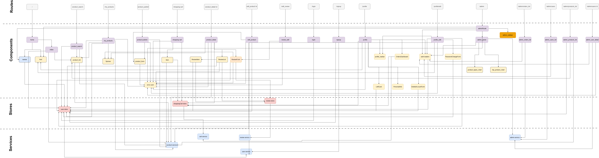

### **Participación de Miembros en la Práctica 3**

#### **Alumno 1 - [Marcos Hernández Martín]**

Encargado de la implementación de autenticación, edición y visualización del perfil de usuario, gestión del carrito de la compra y gestión de reseñas.

| Nº | Commits | Files |
|:--:|:--------|:------|
| 1 | [Implementación de login y store de usuario](https://github.com/CodeURJC-DAW-2025-26/practica-daw-2025-26-grupo-3/commit/d9323cbf7e24c1e143f4e2efb7c614464f9d9e15) | [user-store.tsx](https://github.com/CodeURJC-DAW-2025-26/practica-daw-2025-26-grupo-3/blob/d9323cbf7e24c1e143f4e2efb7c614464f9d9e15/frontend/app/stores/user-store.tsx) |
| 2 | [Implementación de perfil de usuario](https://github.com/CodeURJC-DAW-2025-26/practica-daw-2025-26-grupo-3/commit/883acc5ff1d39c4ccf18e500559680138aeafa1e) | [profile.tsx](https://github.com/CodeURJC-DAW-2025-26/practica-daw-2025-26-grupo-3/blob/883acc5ff1d39c4ccf18e500559680138aeafa1e/frontend/app/routes/Users/profile.tsx) |
| 3 | [Implementación de formulario de edición de usuario](https://github.com/CodeURJC-DAW-2025-26/practica-daw-2025-26-grupo-3/commit/c44b46a5dda279b1c2ab1485bac40f849d468bcd) | [profile_edit.tsx](https://github.com/CodeURJC-DAW-2025-26/practica-daw-2025-26-grupo-3/blob/c44b46a5dda279b1c2ab1485bac40f849d468bcd/frontend/app/routes/Users/profile_edit.tsx) |
| 4 | [Implementación del carrito de la compra](https://github.com/CodeURJC-DAW-2025-26/practica-daw-2025-26-grupo-3/commit/ff3818c1f267d2a900fb211a6cb74cd9def6708a) | [shopping-cart.tsx](https://github.com/CodeURJC-DAW-2025-26/practica-daw-2025-26-grupo-3/blob/ff3818c1f267d2a900fb211a6cb74cd9def6708a/frontend/app/routes/Products/shopping-cart.tsx) |
| 5 | [Implementación de la lista de reseñas (en commit sucesivos se encuentra la implementación completa de las reseñas)](https://github.com/CodeURJC-DAW-2025-26/practica-daw-2025-26-grupo-3/commit/7ea8dbf7ad29951cc4516f2eb98bcc09eb2a75ec) | [ReviewList.tsx](https://github.com/CodeURJC-DAW-2025-26/practica-daw-2025-26-grupo-3/blob/7ea8dbf7ad29951cc4516f2eb98bcc09eb2a75ec/frontend/app/components/Product/ReviewList.tsx) |

---

#### **Alumno 2 - [Jorge Naranjo Ballesteros]**

Como responsable Full-Stack del Panel de Administración (Backoffice), he desarrollado desde cero la estructura de rutas protegidas, el layout y la centralización de servicios. Implementé las vistas para la gestión integral de usuarios, el catálogo de productos (reutilizando componentes para optimizar código) y un dashboard analítico con gráficos de negocio y sus DTOs. Además, desarrollé todo el sistema de revisión de pedidos, optimizando el Backend en Java (controladores REST, MapStruct y nuevos DTOs) y conectándolo con las nuevas interfaces en React, entregando un entorno de administración seguro, modular y totalmente funcional.

| Nº    | Commits      | Files      |
|:------------: |:------------:| :------------:|
|1| [Add protected admin panel and role-based navigation](https://github.com/CodeURJC-DAW-2025-26/practica-daw-2025-26-grupo-3/commit/458d30c3c2f91e89aec352bc343c07890891e733)  | [Admin_Panel.tsx](https://github.com/CodeURJC-DAW-2025-26/practica-daw-2025-26-grupo-3/commit/458d30c3c2f91e89aec352bc343c07890891e733#diff-7e2f72370f157ec17d5dc63495a300a8f40fef11f898a666467c1cc2e699838a)   |
|2| [implement admin panel and user management](https://github.com/CodeURJC-DAW-2025-26/practica-daw-2025-26-grupo-3/commit/1a37beff2ee1575f68adc674c45128c60c51e0bd)  | [admin_sidebar.tsx](https://github.com/CodeURJC-DAW-2025-26/practica-daw-2025-26-grupo-3/commit/1a37beff2ee1575f68adc674c45128c60c51e0bd#diff-8307b6bf6b7a786ddab8c2d8dfd64039f6451c1b19d6eea61c4e5ee365c85dc4)   |
|3| [implement dashboard charts and secure admin layout](https://github.com/CodeURJC-DAW-2025-26/practica-daw-2025-26-grupo-3/commit/5f042cf26f3f96f85ce12fdadbc2c11da4c6cf21)  | [product_types_chart.tsx](https://github.com/CodeURJC-DAW-2025-26/practica-daw-2025-26-grupo-3/commit/5f042cf26f3f96f85ce12fdadbc2c11da4c6cf21#diff-2c59972e487ad5f400af964f433841439dafd2c16fb938fa5b1dd2b0ec4ff927:~:text=components/Admin-,product_types_chart.tsx,-top_product_chart.tsx)   |
|4| [implement admin pending orders management and approval system](https://github.com/CodeURJC-DAW-2025-26/practica-daw-2025-26-grupo-3/commit/872592182311d2a6d73178239f4688075862770e)  | [OrderRestController.java](https://github.com/CodeURJC-DAW-2025-26/practica-daw-2025-26-grupo-3/commit/872592182311d2a6d73178239f4688075862770e#diff-53f575e7ad34bd2eae320434a47ec336d8e53813dc0face786ff7c2519eb6e0f)   |
|5| [implement published products management view](https://github.com/CodeURJC-DAW-2025-26/practica-daw-2025-26-grupo-3/commits/main/#:~:text=implement%20published%20products%20management%20view)  | [admin_products_list.tsx](https://github.com/CodeURJC-DAW-2025-26/practica-daw-2025-26-grupo-3/commit/e4b72744aed18c3c1d3ba2368ec9918640a48f13#diff-30d102bdba0d17c05cf5f711c54e7aaed7da1a64719a0a911967d64055cb9624)   |

---

#### **Alumno 3 - [Daniel Hernanz Corral]**

El alumno se ha encargado de la implementación de los componentes de lista de productos y product form para que sean reutilizados en diferentes rutas (index, publicar producto, editar producto, entre otros). Ha realizado toda la implementación relacionada con la edición, publicación y eliminación de productos, además de hacer visibles los productos con sus respectivas imágenes en las páginas de index, product_search, my_products, y de forma detallada en la página de product detail. También ha implementado la funcionalidad de cargar más productos del index. También ha contribuido a arreglar diversos errores ocurridos durante el desarrollo de la práctica

| Nº    | Commits      | Files      |
|:------------: |:------------:| :------------:|
|1| [Now the list of product is visible in the main page (index), and also index.tsx now it´s implemented with react boostrap](https://github.com/CodeURJC-DAW-2025-26/practica-daw-2025-26-grupo-3/commit/ba1d4b51fa67442351cf6b113e180a8cc4e4b33b)  | [product_list.tsx](frontend/app/routes/Products/product_list.tsx)   |
|2| [Now products are visible in product_search page. The component product_list is reused in both pages. Fixed some errors that prevented product_list component from working. Added a new function in product services to fetch all products for product_search page and more](https://github.com/CodeURJC-DAW-2025-26/practica-daw-2025-26-grupo-3/commit/86ec451577fd794af5ff3155b2a6f176e3b6ba74)  | [product_search.tsx](frontend/app/routes/Products/product_search.tsx)   |
|3| [Added product detail page with edit and remove buttons only visible to admin or owners. Also now is visible the review form to add reviews to products. Delete product button is completely functional, and also index redirects to login page if the user isn´t logged](https://github.com/CodeURJC-DAW-2025-26/practica-daw-2025-26-grupo-3/commit/598a8567e0586783f1406220bf23c936f48af8f7)  | [product_detail.tsx](frontend/app/routes/Products/product_detail.tsx)   |
|4| [Edit form now is available and completely functional. Products can be edited by owners or admins. I created the product_form component in order to reuse it for publishing products](https://github.com/CodeURJC-DAW-2025-26/practica-daw-2025-26-grupo-3/commit/f72bb4a2c3cc4e11e2f4979df42062470b7c38cd)  | [product_form.tsx](frontend/app/components/Product/product_form.tsx) / [edit_product.tsx](frontend/app/routes/Products/edit_product.tsx)   |
|5| [Publish product form now is visible and functional](https://github.com/CodeURJC-DAW-2025-26/practica-daw-2025-26-grupo-3/commit/a18d8b18b2f5ed977a6bbc471a166e4bba6357e3)  | [product-publish.tsx](frontend/app/routes/Products/product-publish.tsx) / [product_form.tsx](frontend/app/components/Product/product_form.tsx)  |

---
